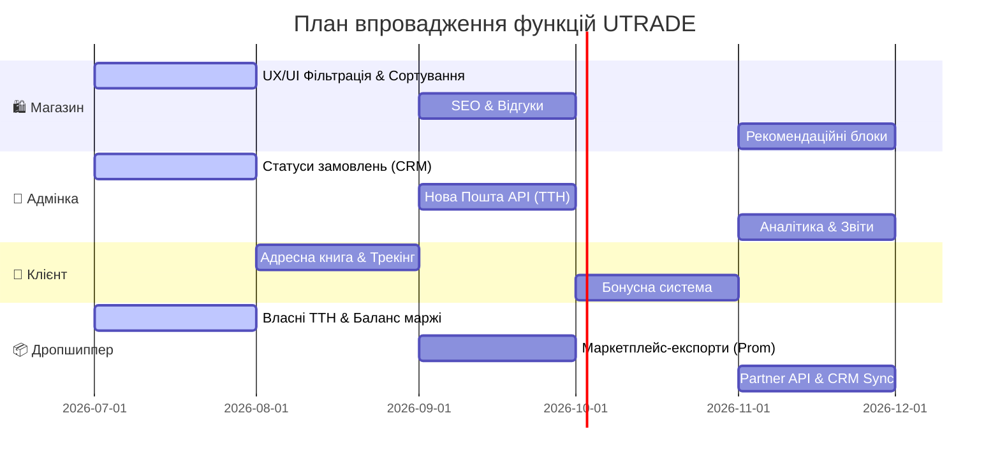

# 🗺️ Дорожня Картка Розвитку Платформи UTRADE

Цей документ містить стратегічний план розвитку та масштабування дропшипінг-платформи та інтернет-магазину **UTRADE**. Він розділений на чотири ключові зони, описує технічні рішення для кожної функції та етапи впровадження.

---

## 🛍️ 1. Функції Інтернет-магазину (E-commerce Frontend)

Мета — перетворити вітрину на високоефективний інтернет-магазин із високою конверсією та ідеальним SEO.

### 🏁 Етап 1: Покращення UX/UI та Фільтрації (High Priority)
*   **Динамічні фільтри характеристик:**
    *   *Опис:* Фільтрація товарів за кольором, розміром, брендом та іншими параметрами (матеріал, інтерфейс підключення тощо), які автоматично зчитуються з бази даних.
    *   *Реалізація:* Розширення індексу товарів `index.json` параметрами характеристик і створення динамічного блоку фільтрів у лівому сайдбарі під деревом категорій.
*   **Інтелектуальне сортування:**
    *   *Опис:* Сортування за популярністю (перегляди/продажі), новинками, ціною (від дешевих до дорогих і навпаки) та розміром знижки.
*   **Список обраного (Wishlist) та Порівняння товарів:**
    *   *Опис:* Можливість зберігати товари «на потім» без додавання в кошик та функціонал порівняння характеристик декількох моделей.
    *   *Реалізація:* Збереження списку ID обраного в `localStorage` (для гостей) та синхронізація з Supabase `wishlists` (для авторизованих користувачів).

### 📈 Етап 2: SEO, Швидкість та Довіра (Medium Priority)
*   **Автоматична генерація SEO-метаданих та Мікророзмітка:**
    *   *Опис:* Генерація динамічних `title`, `description` та `keywords` для кожної сторінки товару та категорії. Впровадження мікророзмітки Schema.org (Product, BreadcrumbList) для відображення красивих сніпетів у Google.
    *   *Реалізація:* Інтеграція `react-helmet-async` на фронтенді та мікророзмітки в шаблони сторінок.
*   **Блок відгуків та запитань (Reviews & Q&A):**
    *   *Опис:* Можливість залишати оцінки (зірочки 1-5), текстові відгуки, прикріплювати реальні фото товарів та ставити запитання менеджеру.
    *   *Реалізація:* Таблиця `reviews` у Supabase з модерацією відгуків через адмінку.
*   **Рекомендаційні блоки (Recommendation Engines):**
    *   *Опис:* Блоки «З цим товаром також купують» (на основі історії замовлень), «Схожі товари» (товари з тієї ж категорії) та «Ви нещодавно переглядали» (історія переглядів у поточній сесії).

---

## 👑 2. Панель Адміністратора (Admin Dashboard)

Мета — автоматизувати операційні процеси, контроль залишків та фінансовий облік.

### 🏁 Етап 1: Управління Замовленнями та Складом (High Priority)
*   **Управління статусами замовлень (CRM-панель):**
    *   *Опис:* Зручний канбан-борд або інтерактивна таблиця для перегляду та зміни статусів замовлень: `Нове` ➡️ `В обробці` ➡️ `Очікує відправки` ➡️ `Відправлено` ➡️ `Доставлено` ➡️ `Повернення` ➡️ `Скасовано`.
    *   *Реалізація:* Пряма синхронізація статусу замовлення з Supabase, автоматична надсилка сповіщень клієнту/дропшипперу при зміні статусу.
*   **Масове редагування цін та націнок:**
    *   *Опис:* Інструмент для швидкого коригування базових цін постачальників або глобальних націнок за категоріями чи брендами (наприклад, +10% на всі мишки Logitech).
*   **Логи синхронізації та парсингу складів:**
    *   *Опис:* Візуальна панель, яка показує статус автоматичного оновлення складів Yavshoke та Mastereva (дата останнього парсингу, кількість оновлених позицій, помилки доступу).

### 📈 Етап 2: Фінанси, Аналітика та Інтеграції (Medium Priority)
*   **Інтеграція з API служб доставки (Нова Пошта, Укрпошта):**
    *   *Опис:* Створення ТТН (експрес-накладних) безпосередньо з адмінки. Автоматичне відстеження статусу посилки за номером ТТН та автоматичний переклад замовлення в статус «Доставлено» або «Відмова».
    *   *Реалізація:* Інтеграція офіційного API Нової Пошти, автоматичний крон-запит для перевірки статусів ТТН кожні 3 години.
*   **Бізнес-аналітика (Dashboard Analytics):**
    *   *Опис:* Графіки прибутку, обсягу продажів, середнього чека, відсотка відмов та повернень. Статистика ефективності роботи постачальників та найактивніших дропшипперів.
    *   *Реалізація:* Візуалізація даних за допомогою бібліотеки `recharts` або `chart.js`.

---

## 👤 3. Кабінет Клієнта (Customer Portal)

Мета — покращити утримання клієнтів (LTV), спростити повторні покупки та автоматизувати сервіс.

### 🏁 Етап 1: Базовий кабінет та трекінг (High Priority)
*   **Історія замовлень із детальним статусом:**
    *   *Опис:* Список усіх покупок з деталізацією (товари, ціни, адреса доставки, ТТН для відстеження посилки на сайті логіста).
*   **Адресна книга та швидке замовлення:**
    *   *Опис:* Можливість зберегти декілька шаблонів одержувачів (наприклад, «Мій склад», «Мама», «Клієнт Іван») із різними містами та відділеннями Нової Пошти для замовлення в 1 клік.
*   **Особисті налаштування профілю:**
    *   *Опис:* Зміна пароля, прив'язка Telegram для отримання сповіщень, керування підпискою на розсилки новин.

### 📈 Етап 2: Лояльність та комунікація (Medium Priority)
*   **Накопичувальна бонусна система:**
    *   *Опис:* Нарахування бонусних балів (кешбек, наприклад, 3-5% від вартості замовлення) за кожну покупку. Балами можна розраховуватися за наступні замовлення.
    *   *Реалізація:* Поле `bonus_balance` у профілі користувача та бізнес-логіка списання балів під час оформлення кошика.
*   **Реферальна програма («Приведи друга»):**
    *   *Опис:* Унікальне реферальне посилання в кабінеті. Клієнт отримує бонуси від покупок залучених користувачів.
*   **Система внутрішньої підтримки (Support Tickets):**
    *   *Опис:* Можливість відкрити звернення (тікет) щодо браку, повернення чи консультації безпосередньо з кабінету, з відстеженням відповідей менеджера.

---

## 📦 4. Кабінет та Інструменти Дропшиппера (Dropshipper Toolkit)

Мета — надати дропшипперам інструменти максимальної автоматизації продажу та вивантаження товарів.

### 🏁 Етап 1: Фінансовий облік та Логістика (High Priority)
*   **Баланс та виплата маржі (Взаєморозрахунки):**
    *   *Опис:* Відображення балансу дропшиппера (нарахована різниця між ціною продажу та оптовою ціною замовлень). Можливість подати запит на виплату коштів на банківську картку (ФОП/фіз. особа).
    *   *Реалізація:* Система транзакцій у Supabase (`balance_transactions`), де кожне замовлення в статусі «Отримано на пошті» автоматично зараховує прибуток на баланс дропшиппера.
*   **Завантаження власних ТТН:**
    *   *Опис:* Можливість для дропшиппера при створенні замовлення вказати власну заздалегідь створену ТТН (якщо він продає под своїм кабінетом Нової Пошти).
    *   *Реалізація:* Додавання опції «Власна ТТН» у форму оформлення замовлення в кошику, яка вимикає генерацію ТТН на боці UTRADE.

### 📈 Етап 2: Розширені експорти та Автоматизація (Medium Priority)
*   **Розширені формати експорту фідів:**
    *   *Опис:* Генерація оптимізованих XML/XLSX файлів під конкретні маркетплейси з урахуванням їхніх вимог до категорій та атрибутів:
        *   *Prom.ua* (підтримка унікальних тегів наявності, знижок, характеристик).
        *   *Rozetka* (жорсткі вимоги до брендів та структури категорій).
        *   *Google Merchant Center* (фіди для контекстної реклами, підтримка gtin, mpn, brand).
        *   *Facebook Catalog* (для таргетованої реклами).
*   **Імпорт замовлень через Excel/CSV:**
    *   *Опис:* Функція завантаження файлу зі списком замовлень від покупців для пакетного створення відправлень в один клік, що економить час при великих обсягах.
*   **Dropshipping API (для великих партнерів):**
    *   *Опис:* Надання REST API платформи UTRADE, за допомогою якого дропшиппери можуть автоматично інтегрувати свої CRM (KeyCRM, SalesDrive, BAS) для:
        *   Отримання актуальних залишків та цін у реальному часі.
        *   Автоматичного створення замовлень у нашій системі.
        *   Отримання номерів ТТН та статусів виконання.

---

## 🛠️ Технологічний стек для реалізації дорожньої картки

*   **Frontend:** React (Vite) + TypeScript + Tailwind CSS (поточний стек).
*   **Backend / Database:** Supabase (PostgreSQL) — збереження профілів, замовлень, відгуків, реферальних зв'язків та балансів.
*   **Serverless Workers (Middlewares):** Cloudflare Workers (для генерації важких XML фідів «на льоту» та обробки вебхуків статусів доставки).
*   **API Інтеграції:** Нова Пошта API v2.0, Укрпошта API.

---

## 📅 Графік впровадження (Черговість релізів)

